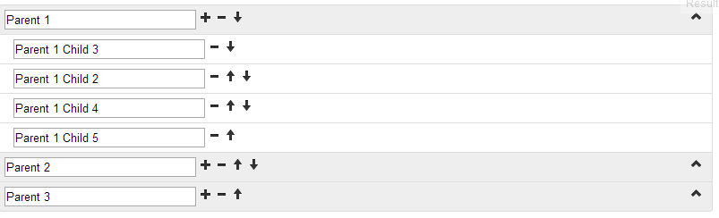

JQuery / Twitter Bootstrap List Tree Plugin is a great plugin, but it does not allow to edit and sort tree elements. I have created an editable version of plugin: The view of tree:

You can find the source code [there](http://pastebin.com/BTA4nL1c) or [here](/code/tree.js).

Also see it [below](http://jsfiddle.net/QD8Hs/1060/).
