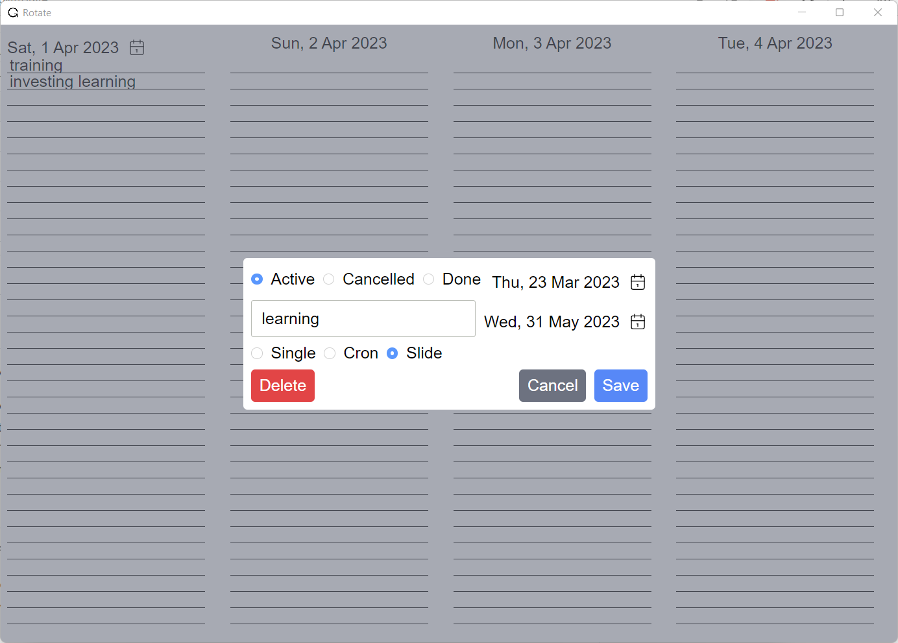

Do you often find yourself struggling to manage your tasks and keep track of deadlines? If so, you're not alone. Many people struggle to stay organized and focused, especially when they have a lot on their plate. That's why desktop todo apps like Rotate can be so helpful.

Rotate is a lightweight and user-friendly app that is designed to help you manage your tasks efficiently. It is built using Elm, a functional programming language, and Neutralinojs, a lightweight and portable framework for building desktop apps using web technologies.

One of the standout features of Rotate is its three types of tasks: Simple, Slice, and Cron. Simple tasks are those with a fixed due date that must be completed by that date. Slice tasks are those that must be completed daily, and if they aren't completed on the current day, they will be moved to the next day automatically. Cron tasks are those that need to be completed regularly based on a cron expression.

Rotate's simple and intuitive user interface makes it easy to create and manage your tasks. You can quickly add new tasks, mark them as complete, and edit or delete them as needed. You can also sort your tasks by due date or priority.

Another great feature of Rotate is its auto-update feature. The app automatically checks for updates and installs them for you, so you always have the latest version of the app with the newest features and bug fixes.

Rotate also saves all your tasks in a JSON file located near the app executable. This means you can easily backup and transfer your tasks to another device if needed.

If you're interested in trying out Rotate, you can find [the project on GitHub](https://github.com/ypyl/rotate). Overall, Rotate is a fantastic desktop todo app that can help you stay organized and focused. With its three types of tasks, auto-update feature, and JSON file saving, Rotate is a reliable and user-friendly app that can make your life easier. Give it a try today and see how it can help you manage your tasks with ease!

*This text was generated by ChatGPT, a large language model trained by OpenAI, based on the GPT-3.5 architecture.*
