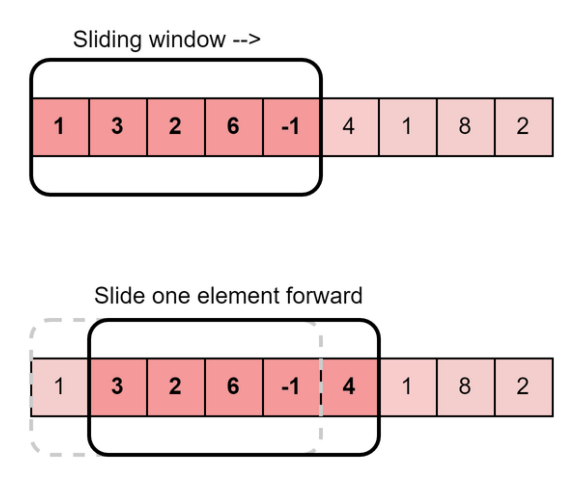
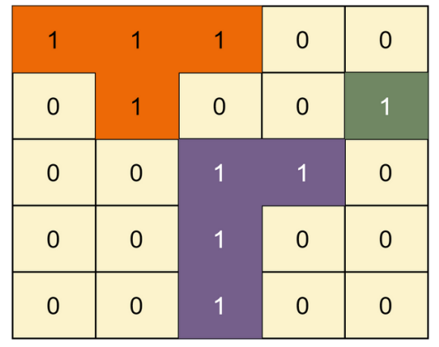
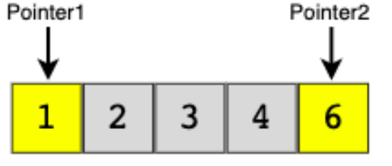
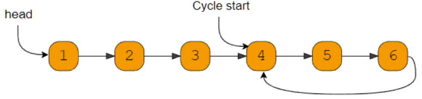
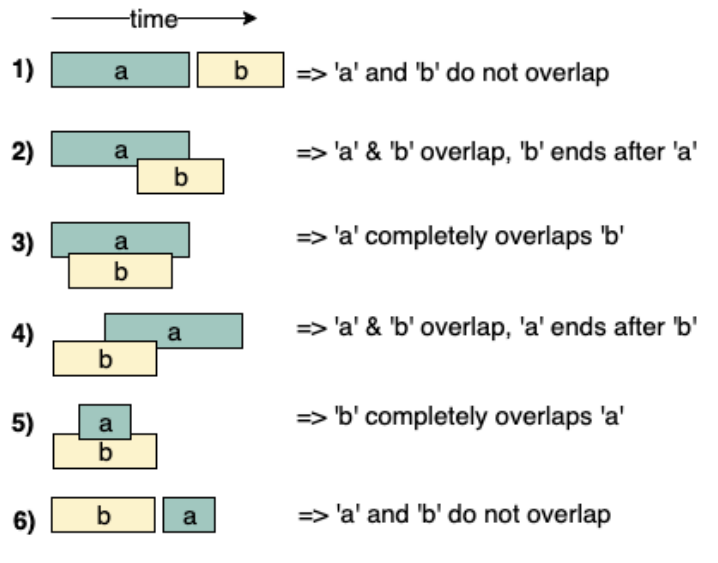
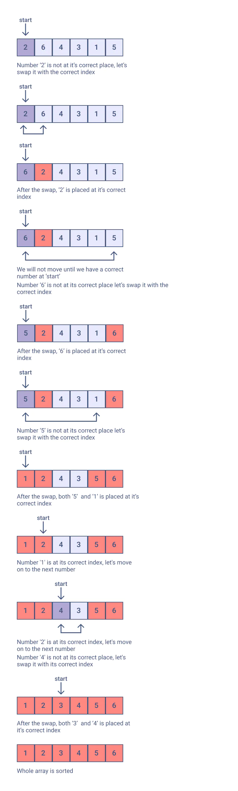
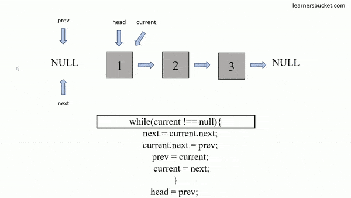
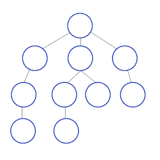
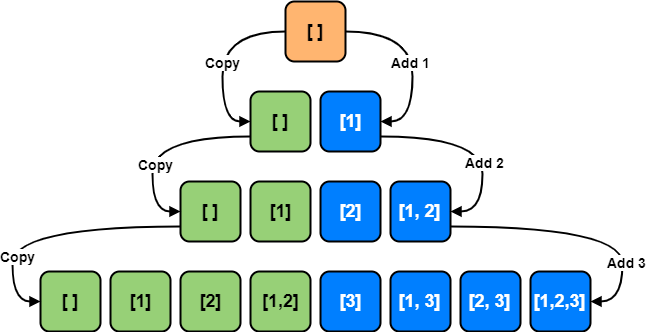

# Sliding Window

## Usage

This algorithmic technique is used when we need to handle the input data in a specific window size.

## Data Structures Involved

Array, String, HashTable

## Sample Problems

### [Longest Substring with 'K' Distinct Characters](https://leetcode.com/problems/longest-substring-without-repeating-characters/description/)

The solution to this problem is to use the sliding window technique. The idea is to maintain a window of size k and slide it over the string. At each step, we check if the current window contains k distinct characters. If it does, we update the maximum length of the substring. If it doesn’t, we slide the window to the right until we find a window that contains k distinct characters again. We repeat this process until we reach the end of the string

### [Fruits into Baskets](https://leetcode.com/problems/fruit-into-baskets/)

It is a sliding window problem where we are given an input array representing different types of fruits and two baskets. We want to collect some fruits from a subarray. However, each basket can only hold one type of fruit. In other words, we can collect at most 2 types of fruits. The picked fruits must fit in one of your baskets. Once you reach a tree with fruit that cannot fit in your baskets, you must stop.

# Islands (Matrix Traversal)

## Usage

This pattern describes all the efficient ways of traversing a matrix (or 2D array).

## Data Structures Involved

Matrix, Queue

## Sample Problems

- [Number of Islands](https://leetcode.com/problems/number-of-islands/)
- [Flood Fill](https://leetcode.com/problems/flood-fill/)
- [Cycle in a Matrix](https://leetcode.com/problems/detect-cycles-in-2d-grid/)

# Two Pointers

## Usage

This technique uses two pointers to iterate input data. Generally, both pointers move in the opposite direction at a constant interval.

## Data Structures Involved

Array, String, LinkedList

## Sample Problems

- [Squaring a Sorted Array](https://leetcode.com/problems/squares-of-a-sorted-array/)
- [Dutch National Flag Problem](https://leetcode.com/problems/sort-colors/solutions/1505473/dutch-national-flag-problem/)
- [Minimum Window Sort](https://leetcode.com/problems/minimum-window-substring/)

# Fast & Slow Pointers

## Usage

Also known as Hare & Tortoise algorithm. This technique uses two pointers that traverse the input data at different speeds.

## Data Structures Involved

Array, String, LinkedList

## Sample Problems

- [Middle of the LinkedList](https://leetcode.com/problems/middle-of-the-linked-list/)
- [Happy Number](https://leetcode.com/problems/happy-number/)
- [Cycle in a Circular Array](https://leetcode.com/problems/circular-array-loop/)

# Merge Intervals

## Usage

This technique is used to deal with overlapping intervals.

## Data Structures Involved

Array, Heap

## Sample Problems

- [Conflicting Appointments](https://leetcode.com/problems/non-overlapping-intervals/)
- [Minimum Meeting Rooms](https://leetcode.com/problems/meeting-rooms-iii/)

# Cyclic Sort

## Usage

Use this technique to solve array problems where the input data lies within a fixed range.

## Data Structures Involved

Array

## Sample Problems

- [Find all Missing Numbers](https://leetcode.com/problems/missing-number/)
- [Find all Duplicate Numbers](https://leetcode.com/problems/find-all-duplicates-in-an-array/)
- [Find the First K Missing Positive Numbers](https://leetcode.com/problems/kth-missing-positive-number/)

# In-place Reversal of a LinkedList

## Usage

This technique describes an efficient way to reverse the links between a set of nodes of a LinkedList. Often, the constraint is that we need to do this in-place, i.e., using the existing node objects and without using extra memory.

## Data Structures Involved

LinkedList

## Sample Problems

- [Reverse every K-element Sub-list](https://leetcode.com/problems/reverse-nodes-in-k-group/)
- [Rotate a LinkedList](https://leetcode.com/problems/rotate-list/)

# Breadth-First Search

## Usage

This technique is used to solve problems involving traversing trees or graphs in a breadth-first search manner.

## Data Structures Involved

Tree, Graph, Matrix, Queue

## Sample Problems

- [Binary Tree Level Order Traversal](https://leetcode.com/problems/binary-tree-level-order-traversal/)
- [Minimum Depth of a Binary Tree](https://leetcode.com/problems/minimum-depth-of-binary-tree/)
- Connect Level Order Siblings

# Depth First Search

## Usage

This technique is used to solve problems involving traversing trees or graphs in a depth-first search manner.

## Data Structures Involved

Tree, Graph, Matrix

## Sample Problems

- Path With Given Sequence
- Count Paths for a Sum

# Two Heaps

## Usage

In many problems, we are given a set of elements that can be divided into two parts. We are interested in knowing the smallest element in one part and the biggest element in the other part. As the name suggests, this technique uses a Min-Heap to find the smallest element and a Max-Heap to find the biggest element.

## Data Structures Involved

Heap, Array

## Sample Problems

- Find the Median of a Number Stream
- Next Interval

# Subsets

## Usage

Use this technique when the problem asks to deal with permutations or combinations of a set of elements.

## Data Structures Involved

Queue, Array, String

## Sample Problems

- String Permutations by changing case
- Unique Generalized Abbreviations

# Modified Binary Search

## Usage

Use this technique to search a sorted set of elements efficiently.

## Data Structures Involved

Array

## Sample Problems

- Ceiling of a Number
- Bitonic Array Maximum

# Bitwise XOR

## Usage

This technique uses the XOR operator to manipulate bits to solve problems.

## Data Structures Involved

Array, Bits

## Sample Problems

- Two Single Numbers
- Flip and Invert an Image

# Top 'K' Elements

## Usage

This technique is used to find top/smallest/frequently occurring 'K' elements in a set.

## Data Structures Involved

Array, Heap, Queue

## Sample Problems

- 'K' Closest Points to the Origin
- Maximum Distinct Elements

# K-way Merge

## Usage

Use this technique to solve problems that involve a list of sorted arrays.

## Data Structures Involved

Array, Queue, Heap

## Sample Problems

- Kth Smallest Number in M Sorted Lists
- Kth Smallest Number in a Sorted Matrix

# Topological Sort

## Usage

Use this technique to find a linear ordering of elements that have dependencies on each other.

## Data Structures Involved

Array, HashTable, Queue, Graph

## Sample Problems

- Tasks Scheduling
- Alien Dictionary

# 0/1 Knapsack

## Usage

This technique is used to solve optimization problems. Use this technique to select elements that give maximum profit from a given set with a limitation on capacity and that each element can only be picked once.

## Data Structures Involved

Array, HashTable

## Sample Problems

- Equal Subset Sum Partition
- Minimum Subset Sum Difference

# Fibonacci Numbers

## Usage

Use this technique to solve problems that follow the Fibonacci numbers sequence, i.e., every subsequent number is calculated from the last few numbers.

## Data Structures Involved

Array, HashTable

## Sample Problems

- Staircase
- House Thief

# Palindromic Subsequence

## Usage

This technique is used to solve optimization problems related to palindromic sequences or strings.

## Data Structures Involved

Array, HashTable

## Sample Problems

- Longest Palindromic Subsequence
- Minimum Deletions in a String to make it a Palindrome

# Longest Common Substring

## Usage

Use this technique to find the optimal part of a string/sequence or set of strings/sequences.

## Data Structures Involved

Array, HashTable

## Sample Problems

- Maximum Sum Increasing Subsequence
- Edit Distance

# Resources

[DesignGurus.org](https://www.designgurus.io/)
[emre.me](https://emre.me/categories/#coding-patterns)
