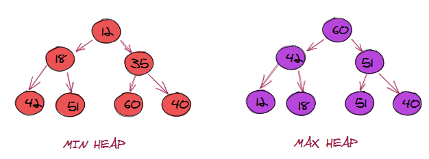

# Sliding Window

## Description

The Sliding Window coding technique is a strategy used in computer programming to efficiently process arrays, strings, or other sequence-based data structures. It involves maintaining a window that slides through the input data, manipulating and updating elements as it moves along. By adjusting the window's size or position based on the problem's requirements, the technique allows for the efficient computation or discovery of subarrays, substrings, or subsequences that satisfy specific conditions. This approach significantly reduces time complexity, often from O(n^2) to O(n) or even O(1), making it ideal for solving problems with large input sizes. By reusing information from the previous window, unnecessary recomputation is avoided, resulting in improved algorithmic performance. Overall, the Sliding Window technique offers an effective solution for efficiently processing sequence-based data, optimizing computations, and solving algorithmic problems.

## Data Structures Involved

Array, String, HashTable

## Sample Problems

### [Longest Substring with 'K' Distinct Characters](https://leetcode.com/problems/longest-substring-without-repeating-characters/description/)

The solution to this problem is to use the sliding window technique. The idea is to maintain a window of size k and slide it over the string. At each step, we check if the current window contains k distinct characters. If it does, we update the maximum length of the substring. If it doesn’t, we slide the window to the right until we find a window that contains k distinct characters again. We repeat this process until we reach the end of the string

### [Fruits into Baskets](https://leetcode.com/problems/fruit-into-baskets/)

It is a sliding window problem where we are given an input array representing different types of fruits and two baskets. We want to collect some fruits from a subarray. However, each basket can only hold one type of fruit. In other words, we can collect at most 2 types of fruits. The picked fruits must fit in one of your baskets. Once you reach a tree with fruit that cannot fit in your baskets, you must stop.

# Islands (Matrix Traversal)

## Description

The Islands (Matrix Traversal) technique is a coding strategy used to solve problems involving matrix traversal and the identification of islands or connected components within the grid. It typically involves iterating through the matrix and using algorithms like DFS or BFS to explore neighboring cells and recursively visit adjacent ones that meet specific criteria. By marking visited cells and efficiently traversing the matrix, this technique enables the efficient identification and manipulation of islands or connected components, reducing time complexity and facilitating analysis of grid-like structures.

## Data Structures Involved

Matrix, Queue

## Sample Problems

- [Number of Islands](https://leetcode.com/problems/number-of-islands/)
- [Flood Fill](https://leetcode.com/problems/flood-fill/)
- [Cycle in a Matrix](https://leetcode.com/problems/detect-cycles-in-2d-grid/)

# Two Pointers

## Description

The Two Pointers technique is a coding strategy used to efficiently solve problems involving sorted arrays or sequences. It utilizes two pointers, often starting from different ends or positions, to traverse and manipulate the data simultaneously. By taking advantage of the sorted nature of the input, the technique allows for optimized traversal and comparison of elements. The pointers can move in different ways based on the problem's requirements, enabling efficient operations such as searching, merging, or identifying patterns within the data. This technique provides an effective approach to solve problems with sorted arrays or sequences, reducing time complexity and improving algorithmic efficiency.

## Data Structures Involved

Array, String, LinkedList

## Sample Problems

- [Squaring a Sorted Array](https://leetcode.com/problems/squares-of-a-sorted-array/)
- [Dutch National Flag Problem](https://leetcode.com/problems/sort-colors/solutions/1505473/dutch-national-flag-problem/)
- [Minimum Window Sort](https://leetcode.com/problems/minimum-window-substring/)

# Fast & Slow Pointers

## Description

The Fast & Slow Pointers technique is a coding strategy that involves using two pointers, fast and slow, to solve problems related to linked lists or sequences. The fast pointer moves at a faster rate, typically advancing by multiple steps per iteration, while the slow pointer lags behind. This technique is particularly useful for tasks like detecting cycles, finding middle elements, or performing operations that rely on the relative speed or distance between elements. By manipulating and comparing the elements at the positions of the fast and slow pointers, various operations can be efficiently performed on linked lists or sequences.

## Data Structures Involved

Array, String, LinkedList

## Sample Problems

- [Middle of the LinkedList](https://leetcode.com/problems/middle-of-the-linked-list/)
- [Happy Number](https://leetcode.com/problems/happy-number/)
- [Cycle in a Circular Array](https://leetcode.com/problems/circular-array-loop/)

# Merge Intervals

## Description

The Merge Intervals technique is a coding strategy that involves combining and consolidating overlapping intervals in a collection. By iterating through the intervals, sorting them if needed, and comparing adjacent intervals, overlapping intervals are merged into a single consolidated set. This technique is particularly useful for solving problems related to interval merging, such as merging meeting schedules or determining the overall coverage of time intervals.

## Data Structures Involved

Array, Heap

## Sample Problems

- [Conflicting Appointments](https://leetcode.com/problems/non-overlapping-intervals/)
- [Minimum Meeting Rooms](https://leetcode.com/problems/meeting-rooms-iii/)

# Cyclic Sort

## Description

The Cyclic Sort technique is a coding strategy used to solve problems involving an array that should ideally contain unique elements within a specific range. It involves iteratively placing each element in its correct position by cycling through the array until all elements are properly sorted. The technique utilizes the fact that the array elements and their indices often share a correlation, allowing for efficient sorting in linear time complexity. By repeatedly swapping elements and cycling through the array, the Cyclic Sort technique provides an intuitive and efficient approach to achieve a fully sorted array with minimal additional space requirements.

## Data Structures Involved

Array

## Sample Problems

- [Find all Missing Numbers](https://leetcode.com/problems/missing-number/)
- [Find all Duplicate Numbers](https://leetcode.com/problems/find-all-duplicates-in-an-array/)
- [Find the First K Missing Positive Numbers](https://leetcode.com/problems/kth-missing-positive-number/)

# In-place Reversal of a LinkedList

## Description

The In-place Reversal of a LinkedList technique is a coding strategy used to reverse the order of elements in a linked list without using additional data structures. It involves manipulating the pointers within the linked list to change the direction of links between nodes. By iteratively reversing the connections between nodes, the linked list is transformed into its reverse order. This technique allows for an efficient reversal of the linked list in constant space complexity, making it particularly useful when memory usage needs to be minimized.

## Data Structures Involved

LinkedList

## Sample Problems

- [Reverse every K-element Sub-list](https://leetcode.com/problems/reverse-nodes-in-k-group/)
- [Rotate a LinkedList](https://leetcode.com/problems/rotate-list/)

# Breadth-First Search

## Description

The Breadth-First Search (BFS) technique is a coding strategy used to traverse or search graph-like structures in a breadthward manner. It starts from a specified source vertex and explores its neighboring vertices before moving on to the next level of vertices. The BFS technique uses a queue data structure to maintain the order of traversal, enqueueing adjacent vertices and dequeuing them as they are visited. This approach ensures that vertices at each level are visited before moving deeper into the graph. BFS is commonly employed to solve problems like finding the shortest path, connected components, or level order traversal in trees or graphs. It guarantees that the shortest path is found when the graph has uniform edge weights, making it an effective and widely used technique for graph traversal and related problem-solving.

## Data Structures Involved

Tree, Graph, Matrix, Queue

## Sample Problems

- [Binary Tree Level Order Traversal](https://leetcode.com/problems/binary-tree-level-order-traversal/)
- [Minimum Depth of a Binary Tree](https://leetcode.com/problems/minimum-depth-of-binary-tree/)
- Connect Level Order Siblings

# Depth First Search

## Description

The Depth First Search (DFS) technique is a coding strategy used to traverse or search graph-like structures in a depthward manner. It starts from a specified source vertex and explores as far as possible along each branch before backtracking. The DFS technique utilizes a stack or recursion to keep track of the vertices to visit. It visits a vertex, marks it as visited, and then recursively explores its adjacent unvisited vertices. This process continues until all reachable vertices have been visited or a specific condition is met. DFS is commonly employed to solve problems like finding connected components, detecting cycles, or exploring all possible paths in a graph or tree. Its depthward nature makes it particularly useful for exploring and analyzing graph structures efficiently.

## Data Structures Involved

Tree, Graph, Matrix

## Sample Problems

- Path With Given Sequence
- Count Paths for a Sum

# Two Heaps

## Description

The Two Heaps technique is a coding strategy that utilizes two separate heaps, a min heap and a max heap, to efficiently manage and manipulate elements in a dataset requiring minimum and maximum operations. Elements are inserted into the appropriate heap based on their values, ensuring that the minimum element can be accessed from the min heap, and the maximum element from the max heap, both in constant time complexity. This technique is particularly valuable for solving problems like finding the median or maintaining sliding windows with minimum and maximum values, offering an efficient solution by leveraging the benefits of two heaps.

## Data Structures Involved

Heap, Array

## Sample Problems

- Find the Median of a Number Stream
- Next Interval

# Subsets

## Description

The Subsets technique is a coding strategy used to generate all possible subsets of a given set or array. It involves systematically exploring different combinations of elements in the set to create all possible subsets. The technique typically employs backtracking or iterative approaches to generate subsets by including or excluding elements at each step. By exhaustively considering all possible combinations, the Subsets technique allows for the comprehensive enumeration of subsets. This technique is commonly used in problems involving combinatorics, power set generation, or solving tasks that require analyzing and manipulating subsets of a set or array.

## Data Structures Involved

Queue, Array, String

## Sample Problems

- String Permutations by changing case
- Unique Generalized Abbreviations

# Modified Binary Search

## Description

The Modified Binary Search technique is a coding strategy used to efficiently search for specific elements or conditions in sorted arrays or sequences. It involves a variation of the binary search algorithm, tailored to address problems that require finding elements with specific properties rather than exact matches. By comparing the target element or condition with the middle element of the sorted array, the search space is narrowed down by adjusting the search boundaries. This technique allows for a significant reduction in search time complexity, often achieving logarithmic time complexity (O(log n)). The Modified Binary Search technique is commonly used in tasks such as finding the first or last occurrence of a target element, locating the insertion point for a value, or determining if a condition is met within a sorted array or sequence.

## Data Structures Involved

Array

## Sample Problems

- Ceiling of a Number
- Bitonic Array Maximum

# Bitwise XOR

## Description

The Bitwise XOR (exclusive OR) technique is a coding strategy used to perform logical operations on individual bits of binary numbers. It involves applying the XOR operator (^) to corresponding bits of two numbers, resulting in a new number with bits that are set (1) only when the corresponding bits in the operands are different. The Bitwise XOR operation can be used to manipulate and extract information from binary representations efficiently. It is commonly used in various applications, including encryption, checksum calculation, finding single unique elements in an array, or swapping values without using a temporary variable. The Bitwise XOR technique provides a powerful tool for performing bitwise operations and extracting valuable information from binary representations.

## Data Structures Involved

Array, Bits

## Sample Problems

- Two Single Numbers
- Flip and Invert an Image

# Top 'K' Elements

## Description

The Top 'K' Elements technique is a coding strategy used to efficiently identify and retrieve the K largest or smallest elements from a collection or data structure. It involves utilizing appropriate data structures, such as priority queues or heaps, to keep track of the K elements with the highest or lowest values based on the specific problem requirements. By maintaining the desired number of elements in the data structure, the Top 'K' Elements technique allows for constant time complexity when accessing the top K elements. This technique is particularly useful in scenarios like finding the K largest or smallest elements, finding the median, or solving problems that involve ranking or selecting elements based on their values. By leveraging the Top 'K' Elements technique, the efficient retrieval of the top K elements can be achieved, even from large datasets or collections.

## Data Structures Involved

Array, Heap, Queue

## Sample Problems

- 'K' Closest Points to the Origin
- Maximum Distinct Elements

# K-way Merge

## Description

The K-way Merge technique is a coding strategy used to merge K sorted arrays or sequences into a single sorted array or sequence. It involves merging the arrays or sequences by comparing the elements from each array or sequence and selecting the smallest (or largest) element to form the merged output. The technique typically uses a priority queue or a heap data structure to efficiently select the next element from each array or sequence. By iteratively selecting the smallest (or largest) element and advancing the corresponding array or sequence, the K-way Merge technique allows for the creation of a single sorted output with a time complexity proportional to the total number of elements across all K arrays or sequences. This technique is particularly useful when dealing with scenarios involving large or distributed datasets that need to be merged and sorted efficiently.

## Data Structures Involved

Array, Queue, Heap

## Sample Problems

- Kth Smallest Number in M Sorted Lists
- Kth Smallest Number in a Sorted Matrix

# Topological Sort

## Description

The Topological Sort technique is a coding strategy used to order the vertices of a directed acyclic graph (DAG) in such a way that for every directed edge (u, v), vertex u appears before vertex v in the ordering. It involves systematically visiting the vertices of the graph while respecting the direction of the edges. The Topological Sort technique typically utilizes depth-first search (DFS) or breadth-first search (BFS) algorithms to explore and order the vertices. By visiting the vertices in a specific order, the technique ensures that dependencies between vertices are satisfied, making it particularly useful for tasks such as project scheduling, dependency resolution, or determining a linear order of events. The Topological Sort technique provides an efficient way to establish a consistent ordering of vertices in a DAG, facilitating the solution of various graph-related problems.

## Data Structures Involved

Array, HashTable, Queue, Graph

## Sample Problems

- Tasks Scheduling
- Alien Dictionary

# 0/1 Knapsack

## Description

The 0/1 Knapsack technique is a coding strategy used to solve problems that involve maximizing the value of items selected for a knapsack while considering their weights and a given weight capacity constraint. It involves making decisions on whether to include or exclude each item in the knapsack to achieve the maximum value without exceeding the weight capacity. The technique typically utilizes dynamic programming to build a table or memoization to store and reuse intermediate results for optimal subproblems. By considering the values and weights of items and iteratively calculating the maximum achievable value for different weight capacities, the 0/1 Knapsack technique provides an efficient solution for problems related to item selection and knapsack optimization. It allows for dynamic decision-making and facilitates the identification of the most valuable combination of items that can be carried within the weight constraint.

## Data Structures Involved

Array, HashTable

## Sample Problems

- Equal Subset Sum Partition
- Minimum Subset Sum Difference

# Fibonacci Numbers

## Description

The Fibonacci Numbers technique is a coding strategy used to efficiently calculate or generate the Fibonacci sequence. It involves using iterative or recursive algorithms to compute the Fibonacci numbers, where each number is the sum of the two preceding numbers in the sequence (starting with 0 and 1). The technique typically utilizes dynamic programming or memoization to store and reuse intermediate results for optimal performance. By avoiding redundant calculations and efficiently building the sequence, the Fibonacci Numbers technique allows for the generation of Fibonacci numbers with improved time complexity. It is commonly used in various applications, such as calculating mathematical series, modeling growth patterns, or solving problems that involve recursive sequences. The Fibonacci Numbers technique provides an effective approach for generating Fibonacci numbers and analyzing related mathematical patterns.

## Data Structures Involved

Array, HashTable

## Sample Problems

- Staircase
- House Thief

# Palindromic Subsequence

## Description

The Palindromic Subsequence technique is a coding strategy used to identify and analyze subsequences within a string or sequence that are palindromic, meaning they read the same forwards and backwards. It involves examining all possible subsequence combinations and checking if they form palindromes. This technique typically employs dynamic programming to efficiently store and reuse intermediate results, enabling faster computation of palindromic subsequences. By considering the properties of palindromes, such as the symmetric nature of their characters, the Palindromic Subsequence technique allows for the identification of the longest or specific types of palindromic subsequences. It is commonly used in applications like string manipulation, text processing, or solving problems that involve palindromic patterns or constraints. The Palindromic Subsequence technique provides an effective approach to analyze and extract palindromic subsequences within a given sequence.

## Data Structures Involved

Array, HashTable

## Sample Problems

- Longest Palindromic Subsequence
- Minimum Deletions in a String to make it a Palindrome

# Longest Common Substring

## Description

The Longest Common Substring technique is a coding strategy used to find the longest substring that is common to multiple strings. It involves comparing the characters of the given strings and identifying the longest continuous substring that appears in all of them. This technique typically employs dynamic programming or memoization to efficiently store and reuse intermediate results, allowing for faster computation of the longest common substring. By examining all possible substrings and their commonality across the strings, the Longest Common Substring technique enables the identification of the longest shared sequence. It is commonly used in applications like string matching, DNA sequence analysis, or solving problems that require finding similarities between multiple strings. The Longest Common Substring technique provides an effective approach to determine the longest common substring and analyze the shared characteristics among multiple strings.

## Data Structures Involved

Array, HashTable

## Sample Problems

- Maximum Sum Increasing Subsequence
- Edit Distance

# Resources

[DesignGurus.org](https://www.designgurus.io/)
[emre.me](https://emre.me/categories/#coding-patterns)
