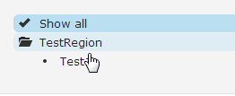

Add "Show All" to the FuelUX Tree like this.



There is the [tree plugin](https://exacttarget.github.io/fuelux/#tree). You can add the next code after initialization of the tree:
```js
scope.find('#MyTree').on('selected', function (event, data) {
    if (data.target.additionalParameters.id == 0) {
        scope.find('#MyTree').find('.tree-item').removeClass('tree-selected').find('i').removeClass('icon-ok').addClass('tree-dot');
        scope.find('#MyTree').find('.tree-item:eq(1)').addClass('tree-selected').find('i').removeClass('tree-dot').addClass('icon-ok');
        scope.find('#MyTree').find('.tree-folder-header> i.icon-ok').remove();
    }
    else {
        scope.find('#MyTree').find('.tree-item:eq(1)').removeClass('tree-selected').find('i').removeClass('icon-ok').addClass('tree-dot');
        if (data.target.additionalParameters.type == 'anyOther') {
            data.element.closest('.tree-folder-content').find('.tree-item:gt(0)').removeClass('tree-selected').find('i').removeClass('icon-ok').addClass('tree-dot');
        }
    }

});
```
