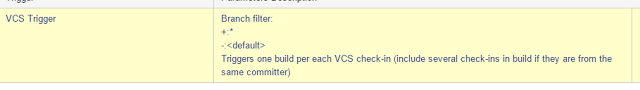

GitVersion is the utility to set up version of deployed assemblies using information from Git.

There is an easy way to set up it on your TC build server. Go to MetaRunner and download MR_GitVersion3.xml file. You should put this file to your build server. The path is C:\ProgramData\JetBrains\TeamCity\config\projects\{Project}\pluginData\metaRunners. The first part of this part you can find in Global settings of Team City. Also you have to restart your server after this.

So you will be able to set up GitVersion build step which just gran information about your version from Git tags and put it to your assemblies.

TC to build only commits with tags (RC-*). VCS Root set up:

Trigger:

